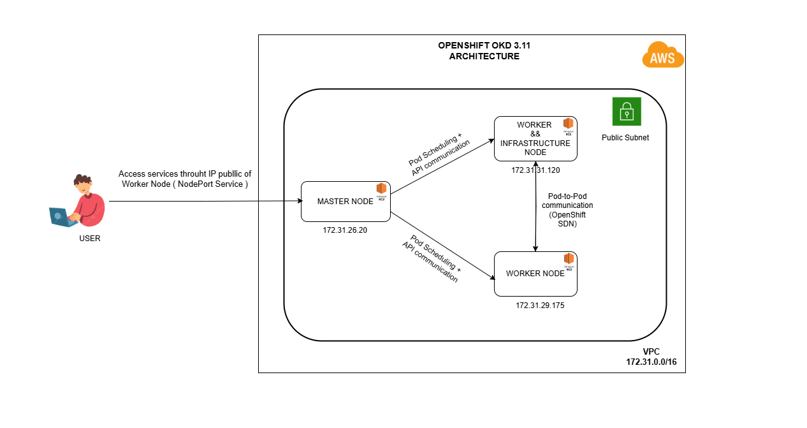

# 📌 Overview
Deploy the OpenShift OKD 3.11 platform and integrate the deployment of a sample application using a microservices architecture (Simple_Microservice_QuizApp) to validate the platform's capability and stability for application deployment

# 📝 Introduction
OpenShift OKD 3.11 is the open-source (community edition) version of Red Hat OpenShift Container Platform, built on Kubernetes and developed by the community
With OKD, user can experience OpenShift for free, making it suitable for development, testing, research environments or small businesses that do not require commercial support from Red Hat

Key features of OpenShift OKD 3.11 are based on:
+ Kubernetes 1.11
+ Docker (container engine)
+ Origin Orchestration system
+ Uses the Ansible system for cluster installation and management

# ⚙️ System architecture of OKD 3.11
OKD 3.11 component structure of the project:
+ Master node: Run API Server, Scheduler, Controller,..
+ Infrastructure node: Run router, registry, metrics, logging of system
+ Worker node: Run pods

Deployment on 3 EC2 on AWS platform. One node takes on the roles of Infrastructure Node and Worker Node

# ⚙️ System architecture of microservice
The application is designed using a microservices model, consisting of:
+ Eureka Server: acts as service discovery, where other services register and discover each other
+ API Gateway: Handles all requests from the client side and routes them to the corresponding services
+ Question service and Quiz service: are 2 main services representing the system's operations.

